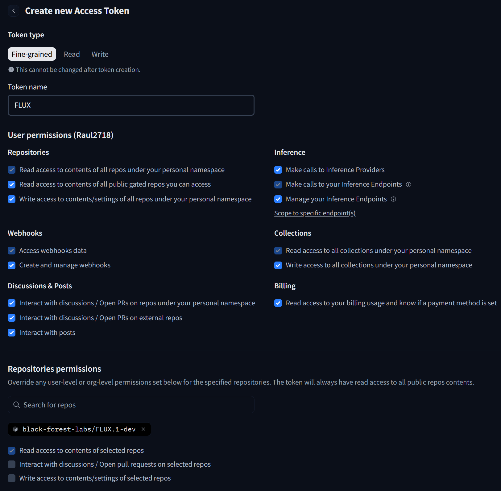
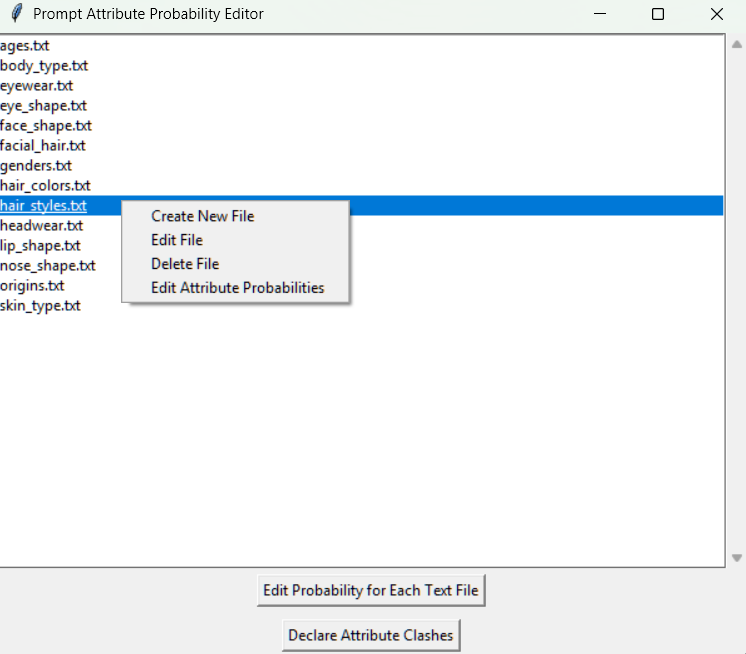
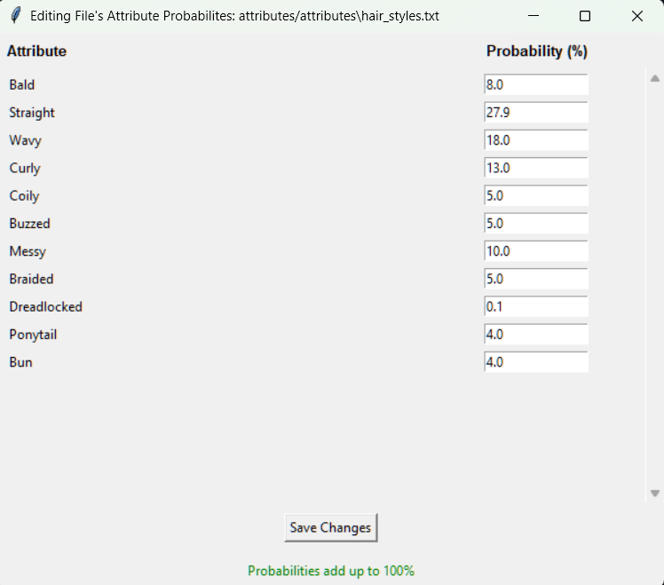
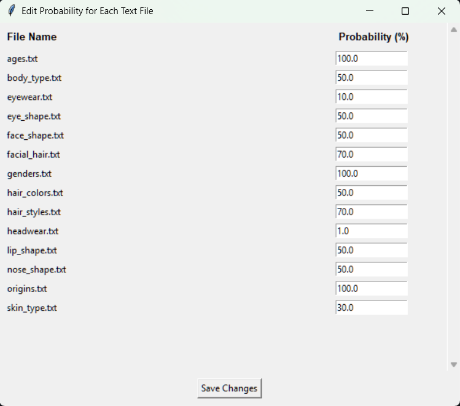
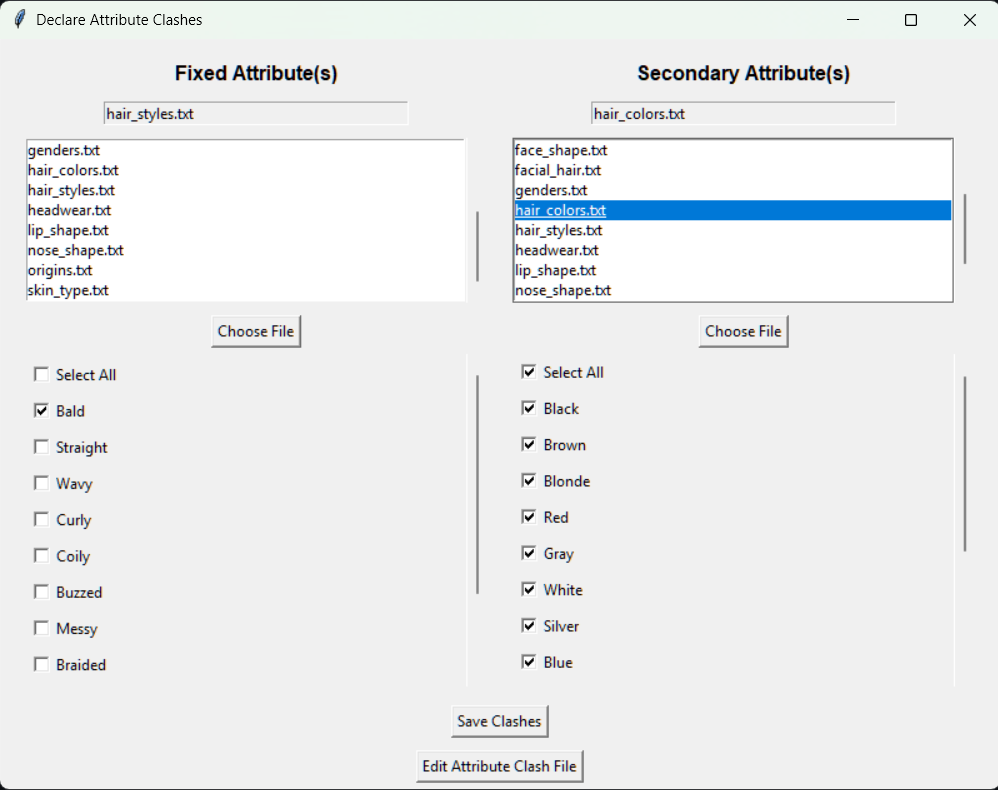

[](https://arxiv.org/abs/2505.07530)


# FLUXSynID

**FLUXSynID** is a framework for generating high-resolution synthetic face datasets with controllable identity attributes. It produces paired document-style and live capture images per identity, making it ideal for biometric research tasks such as face recognition and morphing attack detection.

You can find the full paper on [arXiv](https://arxiv.org/abs/2505.07530).

**[Download FLUXSynID Dataset (14,889 Synthetic Identities) from Zenodo](https://zenodo.org/records/15172770)**


## Table of Contents

- [Installing](#installing)
  - [Linux/Windows/WSL (Shared Steps)](#linuxwindowswsl-shared-steps)
    - [Download HuggingFace models](#download-huggingface-models)
    - [Final Setup (Per OS)](#final-setup-per-os)
      - [Linux/WSL-only](#linuxwsl-only)
      - [Windows-only](#windows-only)
  - [Docker](#docker)
- [Dataset Generation](#dataset-generation)
  - [Setting Identity Attributes](#setting-identity-attributes)
  - [Generating Prompts](#generating-prompts)
  - [Generating Document-Style Images](#generating-document-style-images)
  - [Generating Live Capture Images](#generating-live-capture-images)
- [Similarity-Based Identity Filtering](#similarity-based-identity-filtering)
  - [Face Recognition Model Setup](#face-recognition-model-setup)
  - [Deleting Similar Identities](#deleting-similar-identities)

## Installing

The framework has been validated using **Python 3.11**. Both Linux and Windows OS are supported, with Docker image being the simplest to run. **Note: Only NVIDIA GPUs with [compute capability](https://developer.nvidia.com/cuda-gpus) >= 6.0, CUDA 12.8, and 24GB+ of VRAM are supported**.

### Linux/Windows/WSL (Shared Steps)

Follow these common steps regardless of your OS:

- Git clone this repo:

  ```bash
  git clone https://github.com/Raul2718/FLUXSynID.git
  cd FLUXSynID
  ```

- Set up a virtual Python environment:

  ```bash
  python -m venv .venv
  ```

- Activate your virtual environment:
  - On Linux/WSL:
    ```bash
    source .venv/bin/activate
    ```
  - On Windows (CMD or PowerShell):
    ```powershell
    .venv\Scripts\activate
    ```

- Install PyTorch 2.7 with CUDA 12.8 support:

  ```bash
  pip install torch==2.7.0+cu128 \
      torchvision==0.22.0+cu128 \
      torchaudio==2.7.0+cu128 \
      --index-url https://download.pytorch.org/whl/cu128
  ```

- Install `wheel`:

  ```bash
  pip install wheel==0.45.1
  ```

- Install `GPTQModel`:

  ```bash
  pip install --no-build-isolation -v --no-cache-dir gptqmodel==2.2.0
  ```

- Install packages from `requirements.txt`:

  ```bash
  pip install --no-cache-dir -r requirements.txt
  ```

#### Download HuggingFace models

  1. Go to [https://huggingface.co/settings/tokens/new](https://huggingface.co/settings/tokens/new)
  2. Set a token name (e.g., `FLUX`)
  3. Tick all user permissions
  4. In **Repositories permissions**, enter `black-forest-labs/FLUX.1-dev`
  5. The page should look like this:

     

  6. Create the token and **copy it**
  7. Paste it into the `download_models.py` file on line 7:

     ```python
     HF_TOKEN = "PUT_YOUR_TOKEN_HERE"
     ```

  8. Download all models (**Note: you agree to follow the license agreements of all the models that are downloaded**):

     ```bash
     python download_models.py
     ```

  9. Ensure all models are downloaded without errors

#### Final Setup (Per OS)

Depending on your operating system, follow the appropriate final setup step:

##### Linux/WSL-only

- Run the setup script:

  ```bash
  bash setup.sh
  ```

##### Windows-only

- Install `triton-windows`:

  ```bash
  pip install triton-windows==3.3.0.post19
  ```

- Run the setup script:

  ```bash
  python setup_windows.py
  ```

- If your machine has multiple GPUs, ensure only one is visible to the system:

  ```powershell
  $env:CUDA_VISIBLE_DEVICES="0"
  ```

  > **Note:** This command is for PowerShell. In Bash, use:
  > `export CUDA_VISIBLE_DEVICES=0`

### Docker
A Docker image is provided for easy deployment on systems with NVIDIA GPUs with [compute capability](https://developer.nvidia.com/cuda-gpus) >= 8.0. If your compute capability is between 6.0 and 8.0, you can build your own image on Linux/WSL by following all related installation steps and finally running the `build_image.sh` command. GPUs with a compute capability lower than 6.0 are not supported by this framework.

Follow these steps:

- Git clone this repo:

  ```bash
  git clone https://github.com/Raul2718/FLUXSynID.git
  cd FLUXSynID
  ```

- Set up a virtual Python environment:

  ```bash
  python -m venv .venv
  ```

- Activate your virtual environment:
  - On Linux/WSL:
    ```bash
    source .venv/bin/activate
    ```
  - On Windows (CMD or PowerShell):
    ```powershell
    .venv\Scripts\activate
    ```
    
- Install packages from `requirements_docker.txt`:

  ```bash
  pip install --no-cache-dir -r requirements_docker.txt
  ```

- Download all HuggingFace models by following [these steps](#download-huggingface-models).

- Set up [Docker](https://www.docker.com) with [NVIDIA Container Toolkit](https://docs.nvidia.com/datacenter/cloud-native/container-toolkit/latest/install-guide.html).

- Download the Docker Image using `docker pull raul2718/fluxsynid` command.

- Run Docker with the following command:
  ```bash
  docker run -it --rm --gpus all \
    --ulimit nofile=10000:10000 \
    --shm-size=4g \
    -v "$(pwd)/attributes:/FLUXSynID/attributes" \
    -v "$(pwd)/models/ComfyUI:/FLUXSynID/models/ComfyUI" \
    -v "$(pwd)/models/Arc2Face:/FLUXSynID/models/Arc2Face" \
    -v "$(pwd)/models/huggingface:/FLUXSynID/models/huggingface" \
    -v "$(pwd)/models/face_recognition/adaface/checkpoint/adaface_ir101_webface12m.ckpt:/FLUXSynID/models/face_recognition/adaface/checkpoint/adaface_ir101_webface12m.ckpt" \
    -v "$(pwd)/models/face_recognition/arcface/checkpoint/ArcFace.pth:/FLUXSynID/models/face_recognition/arcface/checkpoint/ArcFace.pth" \
    -v "$(pwd)/models/face_recognition/curricularface/checkpoint/CurricularFace.pth:/FLUXSynID/models/face_recognition/curricularface/checkpoint/CurricularFace.pth" \
    raul2718/fluxsynid:latest
  ```
  > **Note:** If you plan to use [similarity-based identity filtering](#similarity-based-identity-filtering), you must follow the steps in [Face Recognition Model Setup](#face-recognition-model-setup) to download the required checkpoints before running the Docker.
  
## Dataset Generation

### Setting Identity Attributes

The `./attributes/attributes` folder contains 14 pre-defined classes of attributes (e.g., `ages.txt`) which define options and their probabilities. Two configuration files further control how attributes are applied:

- `file_probabilities.json`: sets how likely each attribute class (file) is used in a prompt.
- `attribute_clashes.json`: defines incompatible attribute combinations. When a clash occurs, the fixed attribute is retained.

To modify or extend these attributes, run the configuration GUI:

```bash
python -m attributes.prob_settings_app
```
> **Note:** If you are running the Docker image, it is headless (no GUI support), so you should modify the attributes locally first, then start the Docker container. The container will automatically fetch the updated attributes when it runs.

This opens a GUI with several functions:

#### Main Screen



- **Create New File** (right-click): Add a new attribute class (e.g., `eye_color.txt`). *Use meaningful, descriptive names with underscores* (e.g., `hair_type`, `eye_color`). These names are important because a language model will infer the meaning of the attribute class based on the filename.

- **Edit File** (right-click existing file): Open a text editor to define the values of that class. Each line should contain one attribute (e.g., `Brown`, `Blue` for eye color). Save using the provided button and return to the main screen.

- **Edit Attribute Probabilities** (right-click existing file):

  

  - Set how likely each attribute in the file should appear. Probabilities must sum to 100%.

- **Delete File** (right-click existing file): Remove an attribute class entirely.

#### File Usage Probability

Click `Edit Probability for Each Text File` on the main screen to open:



- Adjust how often each attribute class is used in identity prompts.
- For example, age might be used in 100% of identities, while body type might only be used 50% of the time.
- These settings are saved in `file_probabilities.json`.

#### Attribute Clashes

Click `Declare Attribute Clashes` on the main screen to open:



- Select a fixed attribute file (e.g., `hair_styles.txt`) and a secondary file (e.g., `hair_colors.txt`).
- Choose attributes from each that are incompatible (e.g., `Bald` with `Black`).
- When a fixed attribute is selected during prompt generation, conflicting secondary attributes are removed.
- Clashes are saved in `attribute_clashes.json`.

### Generating Prompts

Generate identity prompts via [**Qwen2.5**](https://arxiv.org/abs/2412.15115) LLM based on your attributes:

```bash
python -m scripts.generate_prompts --dataset_dir FLUXSynID --num 15000
```

This creates a subfolder `FLUXSynID` with 15,000 subfolders, each defining one identity. Adjust `--dataset_dir` and `--num` as needed.

### Generating Document-Style Images

To generate document-style images with  [**FLUX.1 [dev]**](https://huggingface.co/black-forest-labs/FLUX.1-dev) model:

```bash
python -m scripts.generate_document_imgs --dataset_dir FLUXSynID
```

Each identity will receive one generated document-style image.

### Generating Live Capture Images

To generate [**LivePortrait**](https://arxiv.org/abs/2407.03168) and [**PuLID**](https://arxiv.org/abs/2404.16022) live images:

```bash
python -m scripts.generate_live_imgs --dataset_dir FLUXSynID --num_live_imgs 1
```

To generate [**Arc2Face**](https://arxiv.org/abs/2403.11641) live images:

```bash
python -m scripts.generate_live_imgs_arc2face --dataset_dir FLUXSynID --num_live_imgs 1
```

You can increase the number of live images per identity using the `--num_live_imgs` flag.

After all live images are generated, the `dataset_filtering/failed_live.txt` file may list some identities for which face detection on the document-style images failed. This results in missing live images for those identities. To remove these incomplete identities from the dataset, run the following command:

```bash
python -m dataset_filtering.delete_present_folders --dataset_path FLUXSynID --txt_path ./dataset_filtering/failed_live.txt
```

## Similarity-Based Identity Filtering

Optionally, and *preferably before live image generation (right after document image generation)*, you can remove identities which are too visually similar to each other. This ensures dataset diversity and reduces duplicate-like samples.

To run similarity filtering:

```bash
python -m dataset_filtering.find_similar_ids --dataset_dir FLUXSynID --frs adaface --fmr 0.0001
```

This generates a text file:

```bash
./dataset_filtering/similarity_filtering_adaface_thr_0.333987832069397_fmr_0.0001.txt
```

The file lists all identity folders that contain diverse identities and should be kept. Currently supported face recognition systems (FRS): **AdaFace**, **ArcFace**, and **CurricularFace**.

- Use the `--frs` flag to choose the FRS model.
- Use the `--fmr` flag to define the False Match Rate (supports `0.001` and `0.0001`).

### Face Recognition Model Setup

Before running the script, place the weights of the chosen FRS model in the appropriate directory:

- [**AdaFace**](https://arxiv.org/abs/2204.00964): [Google Drive link](https://drive.google.com/file/d/1dswnavflETcnAuplZj1IOKKP0eM8ITgT/view)
  - Save to: `.models/face_recognition/adaface/checkpoint`

- [**ArcFace**](https://arxiv.org/abs/1801.07698): [OneDrive link](https://1drv.ms/u/s!AhMqVPD44cDOhkPsOU2S_HFpY9dC)
  - Rename file to `ArcFace.pth`
  - Save to: `.models/face_recognition/arcface/checkpoint`

- [**CurricularFace**](https://arxiv.org/abs/2004.00288): [Google Drive link](https://drive.google.com/open?id=1upOyrPzZ5OI3p6WkA5D5JFYCeiZuaPcp)
  - Rename file to `CurricularFace.pth`
  - Save to: `.models/face_recognition/curricularface/checkpoint`

### Deleting Similar Identities

Once the similarity filtering script has generated the list, you can use it to retain only the listed identities.

To apply the filtering and delete all other folders from your dataset:

```bash
python -m dataset_filtering.delete_missing_folders --dataset_path FLUXSynID --txt_path <PATH_TO_TXT_GENERATED_BEFORE>
```

## Acknowledgments
The FLUXSynID framework was developed under the EINSTEIN project. The EINSTEIN project is funded by the European Union (EU) under G.A. no. 101121280 and UKRI Funding Service under IFS reference 10093453. Views and opinions expressed are however those of the author(s) only and do not necessarily reflect the views of the EU/Executive Agency or UKRI. Neither the EU nor the granting authority nor UKRI can be held responsible for them.


## Citation
If you use **FLUXSynID** framework in your research or applications, please consider citing us:

```
@misc{Ismayilov2025FLUXSynID,
      title={FLUXSynID: A Framework for Identity-Controlled Synthetic Face Generation with Document and Live Images}, 
      author={Raul Ismayilov and Luuk Spreeuwers and Dzemila Sero},
      journal = {arXiv preprint arXiv:2505.07530},
      year={2025}
}
```
